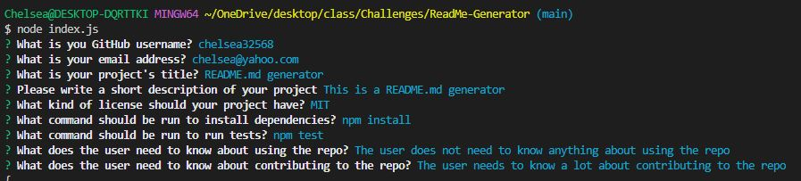
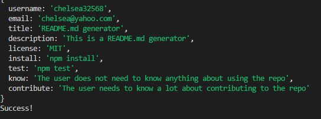
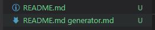
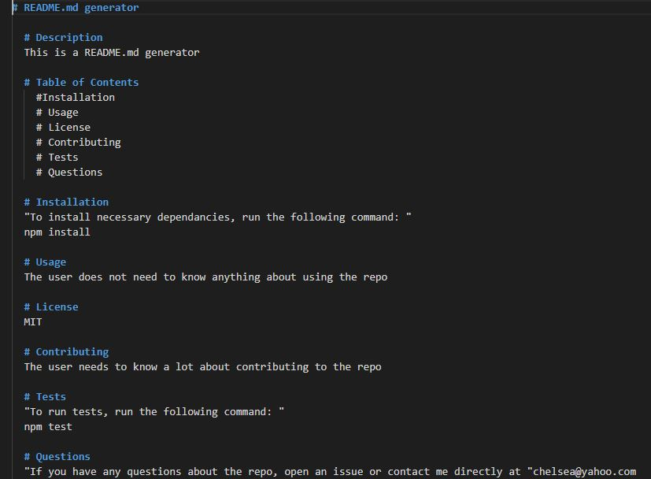

# README.md generator
A command-lind application that dynamically generates a professional README.md file from a user's input. 

Deployed Application - https://chelsea32568.github.io/Weather-App/

Video of README.md generator - https://watch.screencastify.com/v/Eu1NSMCvrvtAnX9Ooaub 

## Description

When a user uses the terminal and runs 'node index.js' they will be prompted for different answers to a variety of questions

After answering the questions, their input will dynamically generate a README.md file based on their input. 

This allows the project creator to devote more time to working on the project. 

## Installation

To work on this code copy this SSH key: git@github.com:chelsea32568/ReadMe-Generator.git and paste into your desired folder using Git Bash. Then use git pull to pull the file into your local repository. Make necessary changes and then add changes into the git repository by using git add -A, git commit -m "", git push.

## Usage

When the user enters 'node index.js' into the terminal they will be prompted for different questions that they need to answer. 

Once all of the questions have been asked, the users input is stored in the terminal. 

The new README.md file is named after the user input for 'title' and stored. 

The user can then see their created README.md file.

This is a video of the README.md file working

## Credits
- [How to display the stored information from the terminal in the README.md file] Andrew Hardemon - Online Tutoring Service

## License

MIT License

Copyright (c) [2023] [Chelsea Chapman]

Permission is hereby granted, free of charge, to any person obtaining a copy
of this software and associated documentation files (the "Software"), to deal
in the Software without restriction, including without limitation the rights
to use, copy, modify, merge, publish, distribute, sublicense, and/or sell
copies of the Software, and to permit persons to whom the Software is
furnished to do so, subject to the following conditions:

The above copyright notice and this permission notice shall be included in all
copies or substantial portions of the Software.

THE SOFTWARE IS PROVIDED "AS IS", WITHOUT WARRANTY OF ANY KIND, EXPRESS OR
IMPLIED, INCLUDING BUT NOT LIMITED TO THE WARRANTIES OF MERCHANTABILITY,
FITNESS FOR A PARTICULAR PURPOSE AND NONINFRINGEMENT. IN NO EVENT SHALL THE
AUTHORS OR COPYRIGHT HOLDERS BE LIABLE FOR ANY CLAIM, DAMAGES OR OTHER
LIABILITY, WHETHER IN AN ACTION OF CONTRACT, TORT OR OTHERWISE, ARISING FROM,
OUT OF OR IN CONNECTION WITH THE SOFTWARE OR THE USE OR OTHER DEALINGS IN THE
SOFTWARE.

© 2023 edX Boot Camps LLC. Confidential and Proprietary. All Rights Reserved.
